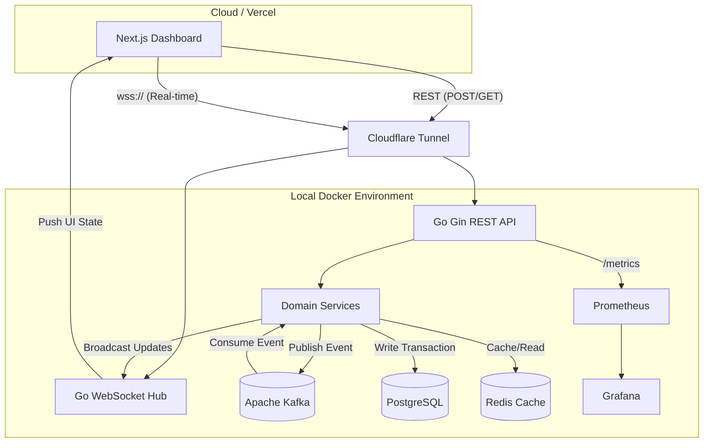
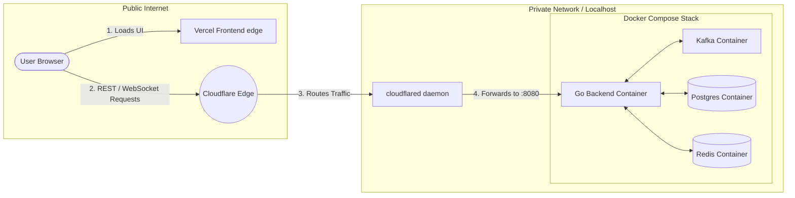

# LedgerX

**LedgerX** is a modern, high-performance, event-driven ledger and reconciliation engine. It simulates, processes, and reconciles high volumes of financial transactions in real-time. 

**Live Dashboard**: [https://frontend-ten-gamma-80.vercel.app/overview](https://frontend-ten-gamma-80.vercel.app/overview)

Designed with a scalable **Go** backend and a reactive **Next.js** frontend dashboard, LedgerX uses **Kafka** for asynchronous event processing, **Redis** for high-speed caching, and **WebSockets** for pushing live updates to the user interface.

---

## Key Features

- **Real-Time Dashboard**: A Next.js UI using Tailwind CSS and shadcn/ui, featuring live metric counters, active transaction feeds, and system health status.
- **Event-Driven Architecture**: Uses Apache Kafka to decouple transaction ingestion from downstream event processing and reconciliation.
- **Live WebSockets**: Pushes real-time transaction updates, reconciliation status changes, and system alerts directly to the frontend client without polling.
- **Automated Reconciliation**: Continuously reconciles transaction records against the stored event history to flag mismatched, missing, or pending data.
- **Simulation Engine**: Includes an integrated load-testing simulator capable of generating synthetic transaction bursts for benchmarking.
- **Observability**: Exposes Prometheus metrics and provides pre-configured Grafana dashboards for deep system insights.
- **Hybrid Deployment Ready**: Fully configured to run the UI on Vercel while tunneling backend API and WebSocket traffic securely to local/private Docker containers via Cloudflare.

---

## Architecture

LedgerX relies on a microservices-inspired architecture designed for high throughput and eventual consistency.



### Event Flow (The Ledger Lifecycle)
1. **Ingestion**: A transaction is submitted via the REST API (`/transactions`).
2. **Persistence**: The initial `PENDING` state is written to PostgreSQL.
3. **Broadcast**: A `TransactionCreated` event is published to Kafka.
4. **Consumption**: The Kafka Consumer group reads the event asynchronously.
5. **Reconciliation**: The reconciliation worker validates the transaction, updating its status to `MATCHED` or `MISMATCH`.
6. **Real-Time Notification**: The Go WebSocket Hub broadcasts a JSON message containing the updated state.
7. **UI Mutation**: The Next.js frontend catches the WebSocket message, intercepts the SWR cache, and seamlessly updates the UI without requiring a page refresh.

---

## Technology Stack

### Frontend
- **Framework**: [Next.js 15](https://nextjs.org/) (App Router)
- **Language**: TypeScript
- **Styling**: Tailwind CSS + [shadcn/ui](https://ui.shadcn.com/)
- **Data Fetching & State**: [SWR](https://swr.vercel.app/) (Stale-While-Revalidate)
- **Icons**: Lucide React

### Backend
- **Language**: [Go 1.25+](https://go.dev/)
- **API Framework**: [Gin HTTP](https://gin-gonic.com/)
- **Database Driver**: pgx (PostgreSQL driver and toolkit)
- **WebSockets**: Gorilla WebSocket
- **Metrics**: Prometheus Go Client

### Infrastructure & Services
- **Database**: PostgreSQL 17
- **Message Broker**: Apache Kafka (Kraft mode)
- **Cache**: Redis 7
- **Monitoring**: Prometheus & Grafana
- **Containerization**: Docker & Docker Compose
- **Networking**: Cloudflare Tunnels (cloudflared)

---

## Project Structure

```text
LedgerX/
├── backend/                  # Go Backend Application
│   ├── cmd/server/           # Main application entrypoint
│   ├── internal/             # Domain logic (handlers, models, config)
│   │   ├── kafka/            # Kafka producers and consumers
│   │   ├── server/           # Gin routing and middleware
│   │   └── websocket/        # Real-time hub and client management
│   ├── migrations/           # Postgres SQL schemas
│   ├── Dockerfile            # Backend container definition
│   └── go.mod                # Go module dependencies
│
├── frontend/                 # Next.js Application
│   ├── src/app/              # Next.js App Router pages
│   ├── src/components/       # Reusable UI components & WebSocketProvider
│   ├── src/lib/              # API utilities and types
│   ├── .env.local            # Frontend environment variables
│   └── package.json          # Node dependencies
│
├── deploy/                   # Infrastructure configuration
│   ├── docker-compose.yml    # Full stack orchestration (DB, Kafka, Redis, App)
│   ├── .env                  # Backend environment variables
│   ├── grafana/              # Grafana dashboards and provisioning
│   └── prometheus/           # Prometheus scraping config
│
└── docs/                     # Project documentation and load-testing reports
```

---

## Getting Started (Local Development)

### 1. Prerequisites
- Docker and Docker Compose
- Node.js 18+ and npm
- Go 1.25+ (Optional, if running backend natively outside Docker)

### 2. Start the Backend Infrastructure
Navigate to the `deploy` directory and start all services (PostgreSQL, Kafka, Redis, Prometheus, Grafana, and the Go Backend):
```bash
cd deploy
docker-compose up -d --build
```
*The backend API will be available at `http://localhost:8080`.*
*Grafana will be available at `http://localhost:3001`.*

### 3. Start the Frontend
In a new terminal, navigate to the `frontend` directory:
```bash
cd frontend
npm install
npm run dev
```
*The Next.js dashboard will be available at `http://localhost:3000`.*

---

## Hybrid Deployment Architecture

LedgerX uses a modern hybrid deployment strategy. The frontend is hosted globally on the edge, while the backend stack is fully containerized and runs privately.

1. **Frontend**: Deployed publicly on **Vercel** for high availability and edge caching.
2. **Backend**: The entire backend ecosystem (Go API, PostgreSQL, Kafka, Redis) is bundled as a **fully Dockerized image/stack**. It runs securely on a local machine or private VPS.
3. **Connectivity**: A **Cloudflare Tunnel** (`cloudflared`) bridges the gap. It creates a secure, outbound-only tunnel from the private Docker backend to the public internet, allowing the Vercel frontend to communicate with it without opening any firewall ports.

### Deployment Flow Diagram



**How to connect Vercel to your Docker backend:**
1. Start your local Docker stack (`docker-compose up -d --build`).
2. Run your Cloudflare tunnel: `cloudflared tunnel --url http://localhost:8080`
3. Add the resulting Cloudflare URL to your **Vercel Environment Variables**:
   - `NEXT_PUBLIC_API_BASE_URL` = `https://<your-cloudflare-tunnel-url>`
   - `NEXT_PUBLIC_WS_URL` = `wss://<your-cloudflare-tunnel-url>/ws`

---

## Load Testing

Load testing was performed to benchmark the system's ability to handle high-volume transaction bursts. The results demonstrate LedgerX's high throughput capabilities, efficiently processing and reconciling events via Kafka and WebSockets with minimal latency.

For detailed load testing configurations, metrics, and comprehensive reports, please refer to the documentation provided in the [`docs/`](./docs/) directory.

---

## API Reference

### REST Endpoints

#### 1. Transactions
- **`GET /transactions`**
  - **Description**: Fetches a paginated list of transactions.
  - **Query Params**: `limit` (default: 50), `offset` (default: 0)
  - **Response**: Array of `Transaction` objects `[{ id, external_id, amount, currency, status, created_at, updated_at }]`.

- **`GET /transactions/:id`**
  - **Description**: Fetches a single transaction by its internal ID.
  - **Response**: A `Transaction` object.

- **`POST /transactions`**
  - **Description**: Submits a new transaction into the ledger.
  - **Body**: `{"external_id": "string", "amount": float, "currency": "string"}`
  - **Response**: `201 Created` with the newly created `Transaction` object.

#### 2. Simulation & Dashboard
- **`GET /overview`**
  - **Description**: Fetches the aggregate metrics for the dashboard.
  - **Response**: `{"total_transactions": int, "reconciled": int, "issues": int, "pending": int}`

- **`POST /simulate`**
  - **Description**: Generates a batch of synthetic transactions and domain events (orders, payments, accounting).
  - **Body**: `{"count": int}` (max 1000)
  - **Response**: `{"message": "Simulation completed", "count": int, "transaction_ids": ["uuid", ...]}`

#### 3. Events & Reconciliation
- **`GET /events`**
  - **Description**: Fetches a paginated list of raw Kafka events processed by the system.
  - **Query Params**: `limit` (default: 50), `offset` (default: 0), `transaction_id` (optional)
  - **Response**: Array of `Event` objects.

- **`GET /reconcile/:transaction_id`**
  - **Description**: Fetches the latest reconciliation result for a specific transaction (served directly from Redis cache).
  - **Response**: A `ReconciliationResult` object.

- **`GET /reconcile/:transaction_id/history`**
  - **Description**: Fetches the entire historical log of reconciliation attempts for a transaction.
  - **Response**: Array of `ReconciliationRecord` objects.

#### 4. Health & Observability
- **`GET /health`**
  - **Description**: Deep health check validating connectivity to PostgreSQL, Redis, and Kafka.
  - **Response**: `{"status": "ok", "postgres": "ok", "redis": "ok", "kafka": "ok"}`

- **`GET /ready` & `GET /live`**
  - **Description**: Kubernetes-compatible readiness and liveness probes.

- **`GET /metrics`**
  - **Description**: Prometheus scraper endpoint exposing Go runtime metrics and custom application telemetry (e.g., `ledgerx_reconciliations_total`).

### WebSocket Endpoint
- **`GET /ws`**
  - **Description**: Upgrades the connection to a WebSocket for pushing live dashboard updates.
  - **Event Payloads**: Pushes JSON payloads formatted as `{"type": string, "transaction_id": string, "status": string, "timestamp": string, "details": object}`
  - **Event Types**: `TRANSACTION_CREATED`, `EVENT_PERSISTED`, `RECONCILIATION_COMPLETED`.

