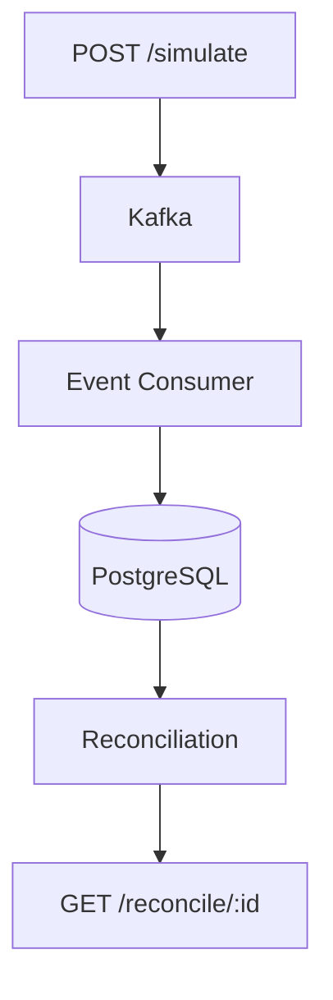
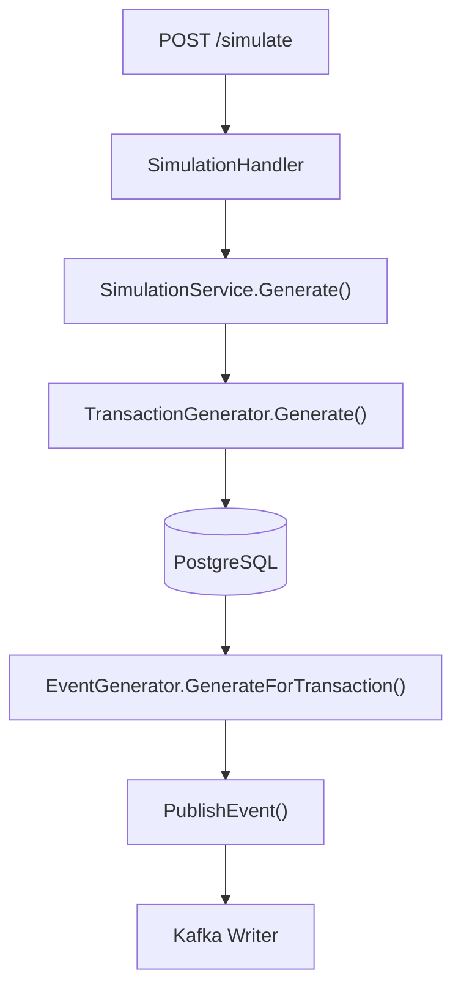
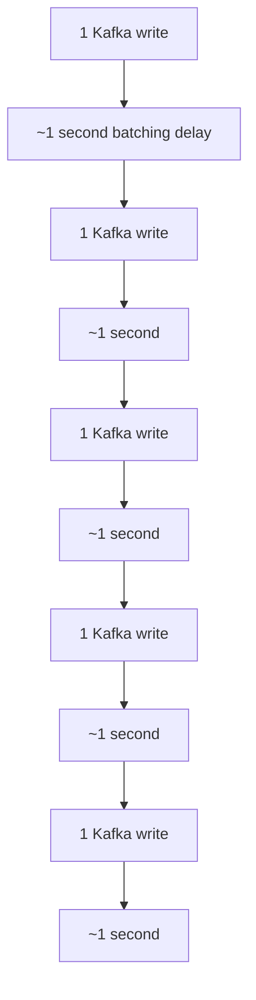
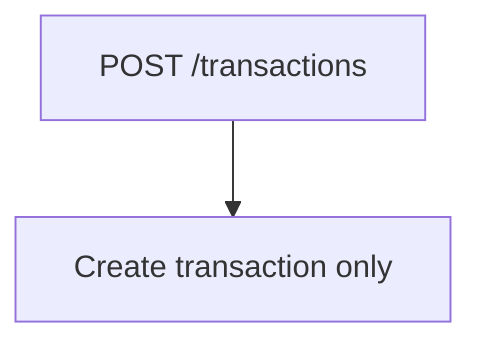
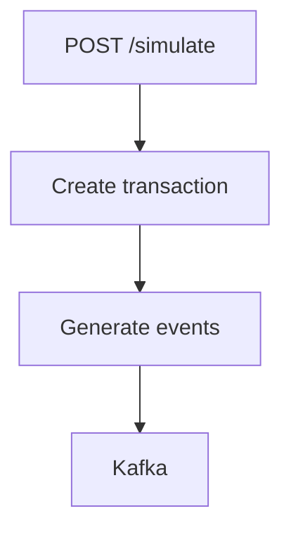
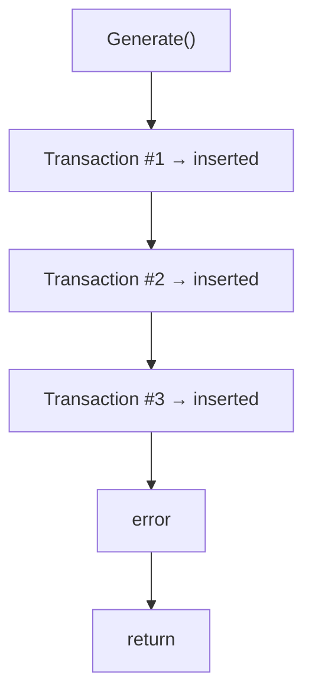
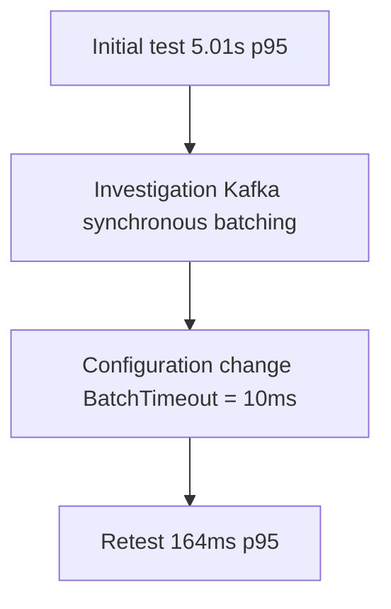

# LedgerX — Load Testing & Performance Investigation Report

## 1. Objective

The objective of load testing was to evaluate LedgerX under concurrent workload and verify:

- API throughput and latency
- Kafka event-processing behavior
- reconciliation reliability
- behavior under concurrent simulation requests
- database/event consistency
- Kafka consumer lag
- failure handling and DLQ behavior
- bottlenecks discovered under load

The tests were performed locally with PostgreSQL, Kafka, Redis and the LedgerX backend running as part of the development environment.

## 2. Test Environment

| Component | Configuration |
|---|---|
| OS | Windows |
| Load Testing Tool | k6 v2.2.0 |
| Backend | Go |
| Database | PostgreSQL 17 |
| Database Runtime | Docker |
| Kafka | Docker |
| Redis | Docker |
| Kafka Client | segmentio/kafka-go |
| Database Port | 5433 |
| Backend Port | 8080 |

## 3. Test Scenarios

Three k6 scenarios were created.

### Test A — Direct Transaction API

**Endpoint:** `POST /transactions`

**Purpose:**

- Measure raw transaction API performance.
- Test PostgreSQL insertion under concurrent traffic.
- Establish a baseline independent of the event simulation pipeline.

**Load:** `10 VUs → 50 VUs → 100 VUs → 0 VUs`

**Duration:** `3 minutes`

### Test B — Simulation Pipeline

**Endpoint:** `POST /simulate`

**Purpose:**

- Generate simulated transactions.
- Generate Kafka events.
- Exercise the asynchronous event pipeline.
- Expose event-processing and Kafka-related bottlenecks.

**Load:** `5 VUs → 10 VUs → 0 VUs`

Each request generated:

```json
{
  "count": 5
}
```

### Test C — Full Reconciliation Flow

**Flow:**



**Purpose:**

- Verify the complete LedgerX processing pipeline.
- Measure time until reconciliation becomes available.
- Verify that downstream reconciliation remains responsive under load.

**Load:** `10 VUs → 30 VUs → 0 VUs`

## 4. Issue #1 — Initial /simulate Latency Bottleneck

### Initial Observation

The first simulation load test produced:

- **Requests:** 105
- **p95 latency:** 5.01 seconds
- **Failure rate:** 7.61%
- **Average latency:** 4.56 seconds

This was clearly unacceptable compared with the direct transaction API.

## 5. Investigation

The execution path was traced:



The PostgreSQL portion was ruled out because the direct transaction test had extremely low latency:

`p95 = 18.23 ms`

The investigation therefore focused on Kafka publishing.

The Kafka writer was configured without an explicit Async setting:

```go
writer: &kafka.Writer{
    Addr:                   kafka.TCP(brokers),
    Topic:                  EventTopic,
    Balancer:               &kafka.LeastBytes{},
    AllowAutoTopicCreation: true,
},
```

The important architectural observation was that the simulation service published the first event synchronously for each generated transaction.

For:

```json
{
  "count": 5
}
```

the request performed five sequential Kafka writes.

## 6. Why the Latency Reached Approximately 5 Seconds

The Kafka writer's batching behavior introduced a delay when individual messages were synchronously published without the batch filling immediately.

The result was approximately:



Therefore:

`5 transactions × ~1 second ≈ 5 seconds`

This matched the observed:

`p95 ≈ 5.01 seconds`

The matching between the code path and measured latency provided strong evidence that Kafka publishing was the synchronous bottleneck.

## 7. Why We Did NOT Simply Use Async: true

An initial possible solution was:

```go
Async: true,
```

However, this would weaken the existing error-handling architecture.

The current publisher has:

```go
if err := g.publisher.PublishEvent(ctx, event); err != nil {
    _ = g.publisher.PublishToDLQ(ctx, event)
}
```

With asynchronous publishing, the application could receive success before Kafka delivery actually succeeds.

That means a broker failure could occur after `PublishEvent()` returned, preventing the synchronous error path from reliably triggering the DLQ mechanism.

Therefore, we chose not to make the main event publisher asynchronous merely to hide the latency.

## 8. Solution — Reduce Kafka Batch Timeout

The Kafka writer configuration was changed to use a much smaller batch timeout while retaining synchronous publishing.

Conceptually:

```go
writer: &kafka.Writer{
    Addr:                   kafka.TCP(brokers),
    Topic:                  EventTopic,
    Balancer:               &kafka.LeastBytes{},
    AllowAutoTopicCreation: true,
    BatchTimeout:            10 * time.Millisecond,
},
```

The same principle was applied to the DLQ writer.

This preserved:

- synchronous publishing
- delivery errors
- DLQ fallback

while removing the unnecessary ~1-second wait for each low-volume batch.

## 9. Result After Kafka Optimization

The simulation test was executed again.

**Before**

```
p95 = 5.01 seconds
failure rate = 7.61%
```

**After**

```
p95 = 164.14 ms
average = 95.10 ms
max = 275.16 ms
```

This represents approximately a 30× reduction in p95 latency.

The result demonstrated that the Kafka batching configuration was the primary cause of the original latency spike.

## 10. Issue #2 — Misinterpretation of Event Loss

The initial load-test report appeared to show a severe event-loss problem.

At one point:

- **Transactions:** 18,146
- **Events:** 3,507

This initially suggested that thousands of events were being lost.

However, the implementation was inspected.

The actual architecture is:



while:



Therefore, it was incorrect to compare all transactions against the number of simulated events.

Only transactions generated through `/simulate` are intentionally passed through the event-generation pipeline.

This corrected the initial conclusion that Kafka was dropping thousands of events.

## 11. Issue #3 — Intentional Missing and Duplicate Events

The simulation engine intentionally introduces distributed-system failure scenarios.

The implementation contains:

**Missing accounting event**

```go
if event.EventType == models.EventAccountingBooked {
    if rand.Float64() < 0.3 {
        continue
    }
}
```

Approximately 30% of accounting events can therefore be intentionally omitted.

**Duplicate payment event**

```go
if event.EventType == models.EventPaymentReceived {
    if rand.Float64() < 0.3 {
        _ = g.generateDuplicateEvent(ctx, event)
    }
}
```

Approximately 30% of payment events can therefore be duplicated.

**Delayed events**

The remaining events are intentionally delayed:

```go
time.Sleep(4 * time.Second)
```

These behaviors are not bugs. They exist specifically to test LedgerX's reconciliation capabilities.

## 12. Issue #4 — Partial Simulation Persistence

During investigation, a small number of simulated transactions were found without associated events.

The investigation showed that `TransactionGenerator.Generate()` inserts transactions individually.

If a later operation fails:



previously inserted transactions remain in PostgreSQL.

Because the simulation endpoint is a testing/orchestration endpoint, this behavior was documented rather than incorrectly classified as Kafka event loss.

For the final investigation, the latest database query showed a small number of historical simulated transactions without events, including two in the latest time window examined.

## 13. Issue #5 — Simulation HTTP Failures Under Load

After fixing the major Kafka latency bottleneck, `/simulate` improved dramatically but still experienced some HTTP failures.

Final simulation test:

- **Requests:** 321
- **Successful:** 317
- **Failed:** 4
- **Failure rate:** 1.24%
- **p95 latency:** 164.14 ms
- **p99 latency:** 253.43 ms

The important distinction is:

`Kafka latency problem → solved`

while:

`occasional /simulate request failures → still observable`

The failures are not evidence of the previous 5-second Kafka bottleneck.

They occur while the simulation endpoint is performing multiple operations and under concurrent load.

This behavior should therefore be recorded as a remaining limitation rather than incorrectly claiming that the entire simulation path has zero failures.

## 14. Issue #6 — Reconciliation Verification

The reconciliation load test was then executed against the updated system.

Final result:

- **Max VUs:** 30
- **Iterations:** 1,864
- **Successful simulations:** 1,758
- **Reconciliation results:** 1,758

Reconciliation timing:

- **Average:** 1.023 seconds
- **p95:** 1.031 seconds
- **p99:** 1.048 seconds
- **Timeouts:** 0

The HTTP reconciliation endpoint itself remained extremely fast:

`p95 = 16.4 ms`

The ~1-second reconciliation time is expected because the test deliberately polls for eventual downstream processing.

## 15. Reconciliation Outcomes

All 1,758 successfully generated transactions eventually produced a reconciliation result.

The test recorded:

`reconciliation_missing = 1758`

This does not mean that 1,758 requests failed.

MISSING is one of LedgerX's expected reconciliation states because the simulator intentionally removes some events.

The important distinction is:

`HTTP failure ≠ reconciliation status MISSING`

The system successfully returned a reconciliation result.

## 16. Kafka Health Verification

Kafka offsets were checked after testing.

The consumer group showed:

- **CURRENT-OFFSET:** LOG-END-OFFSET
- **LAG:** 0

This demonstrates that the consumer had caught up with the Kafka topic after processing.

The Kafka pipeline therefore did not show persistent consumer lag during the verification.

## 17. Final Performance Results

### /transactions

- **Requests:** 7,891
- **Failure rate:** 0%
- **Average:** 7.07 ms
- **p95:** 18.23 ms

### /simulate

After Kafka optimization:

- **Requests:** 321
- **Failure rate:** 1.24%
- **Average:** 95.10 ms
- **p95:** 164.14 ms
- **p99:** 253.43 ms

### /reconcile/:id

- **HTTP p95:** 16.4 ms
- **HTTP failures:** 0%
- **Result timeout:** 0

### End-to-end reconciliation

- **Average:** 1.023 s
- **p95:** 1.031 s

## 18. Before vs After

This is probably the most important table to put in your final project documentation:

| Metric | Before Fix | After Fix |
|---|---|---|
| /simulate p95 | 5.01 s | 164.14 ms |
| /simulate avg | 4.56 s | 95.10 ms |
| /simulate failure rate | 7.61% | 1.24% |
| /transactions p95 | — | 18.23 ms |
| Reconciliation HTTP p95 | — | 16.4 ms |
| Reconciliation time p95 | — | 1.031 s |
| Kafka consumer lag | Verified later | 0 |

## 19. Key Lessons From Load Testing

### 1. Database performance was not the bottleneck

The direct transaction API remained around:

`p95 = 18 ms`

under significant request load.

### 2. Kafka configuration mattered

A synchronous producer with unsuitable batching behavior introduced substantial latency.

### 3. Async processing requires careful reliability design

Simply enabling asynchronous Kafka publishing would have weakened the existing synchronous error → DLQ mechanism.

### 4. Load testing exposed architectural assumptions

The first analysis incorrectly assumed every transaction should produce three events.

Code-level investigation showed that event generation belongs specifically to the simulation workflow.

### 5. Reconciliation correctly handles distributed-system anomalies

The simulator deliberately produces:

- missing events
- duplicate events
- delayed events
- amount mismatches
- out-of-order events

and the reconciliation engine classifies these states rather than treating them as HTTP failures.

## 20. Final Conclusion

Load testing exposed a significant latency bottleneck in LedgerX's Kafka publishing path. The `/simulate` endpoint initially exhibited approximately 5-second p95 latency because multiple synchronous Kafka writes were affected by batching delays. After reducing the Kafka writer batch timeout while retaining synchronous delivery and DLQ error handling, p95 latency decreased to approximately 164 ms.

Subsequent testing verified that the reconciliation endpoint remained responsive under 30 concurrent virtual users, with a 16.4 ms HTTP p95 and zero reconciliation timeouts. Kafka consumer lag was also verified to return to zero after processing.

The investigation also identified and corrected an initial misinterpretation of event loss: `/transactions` intentionally creates database transactions without generating simulated events, whereas `/simulate` orchestrates transaction and event generation. Additionally, missing and duplicate events are deliberate simulation behaviors used to exercise the reconciliation engine.

The load-testing phase therefore served not only as a performance benchmark but also as an architectural validation exercise, exposing the interaction between HTTP APIs, PostgreSQL, Kafka, asynchronous event generation, and reconciliation.

